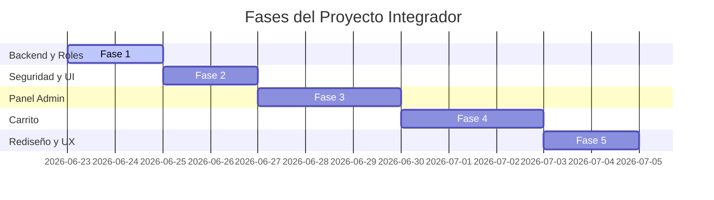
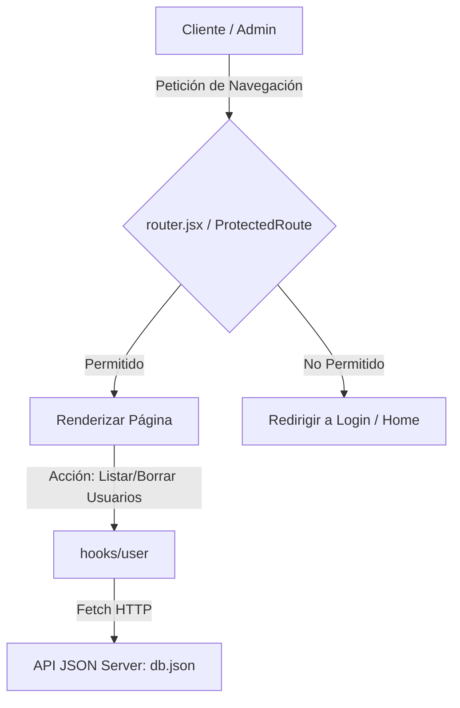
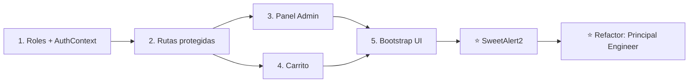

# 📋 Plan de Desarrollo: Próximas Implementaciones

Este documento define la hoja de ruta y especificaciones técnicas para las nuevas funcionalidades del proyecto integrador, tanto para el frontend como para el backend (API de pruebas).

---

## ⚙️ Decisiones de Arquitectura Adoptadas

Tras la definición de requerimientos técnicos, se han acordado las siguientes bases de implementación:

1.  **Persistencia de Carrito**: Se gestionará en memoria del cliente usando `sessionStorage`.
2.  **Formato del Carrito**: La estructura interna será de tipo clave-valor simplificada: `[{ productId: Number, quantity: Number }]`.
3.  **Simulación de Stock**: Al finalizar la compra, se realizará una actualización en lote (`PATCH` / `PUT`) a la colección `/products` del servidor restando la cantidad comprada de la propiedad `quantity`.
4.  **Gestión de Cuentas Administrativas**:
    *   Se definirá un **Superadmin** estático en la base de datos (`db.json`) el cual será de solo lectura (no podrá ser editado ni eliminado por otros administradores).
    *   Los administradores autorizados podrán registrar nuevas cuentas con rol `"admin"`.
5.  **Comportamiento de Redirección (Rutas Protegidas)**:
    *   *Usuario Guest (No Logueado)*: Redirección automática a la vista de login (`/user/login`).
    *   *Usuario Autenticado sin Rol Autorizado*: Redirección automática a la página principal (`/`).
6.  **Estrategia de Búsqueda de Usuarios**: Carga completa inicial de la colección mediante un único `GET /user`. Los resultados se almacenarán en el estado local de React y se filtrarán en memoria del cliente.
7.  **Visualización en Panel de Detalles**: Se presentarán todos los datos del perfil del usuario seleccionado (ID, nombre, email, rol, etc.), excluyendo el historial de compras.
8.  **Eliminación de Usuarios**: Se implementará mediante **borrado lógico (Soft Delete)** añadiendo la propiedad `deletedAt` con la marca de tiempo correspondiente. Los usuarios marcados como eliminados no deben mostrarse en el listado y no podrán loguearse.
9.  **Diseño Visual del Admin**: Se maquetará un layout separado tipo **Dashboard de Administrador** (con menú lateral/sidebar de navegación rápida) para las vistas bajo la ruta `/admin`.
10. **Feedback de Usuario**: Se mantendrán las confirmaciones y notificaciones nativas del navegador (`window.alert` y `window.confirm`) para simplificar y asegurar los flujos críticos.

---

## 🛣️ Fases de Implementación (Cronograma de Trabajo)

Para abordar el proyecto de manera progresiva y controlada, el desarrollo se divide en **5 fases incrementales**:



### 📍 Fase 1: Preparación de Datos y Roles en Autenticación
*   **Objetivo**: Establecer los cimientos del sistema de roles y el Superadmin inicial.
*   **Tareas**:
    *   [ ] Modificar [`db.json`](file:///d:/Users/jl/descargas/utn-2026/182187/25/server/db.json) agregando la propiedad `"role"` (`"admin"` o `"cliente"`) a todos los usuarios, y definir un usuario Superadmin estático inmutable.
    *   [ ] Convertir [`useAuth.jsx`](file:///d:/Users/jl/descargas/utn-2026/182187/29/proyecto-integrador/src/hooks/user/useAuth.jsx) en un **Context** (`AuthContext` + `AuthProvider`) y envolver la app en `main.jsx`, para que el estado de sesión/rol sea único y reactivo en toda la aplicación (hoy es estado local y no se propaga entre componentes). El hook pasa a consumir el contexto con `useContext` y expone la bandera `isAdmin`.
    *   [ ] Almacenar y leer el rol en `sessionStorage` dentro del `AuthProvider`.
    *   [ ] Agregar validación de Soft Delete en [`useLoginUser.jsx`](file:///d:/Users/jl/descargas/utn-2026/182187/29/proyecto-integrador/src/hooks/user/useLoginUser.jsx): el `find` debe excluir usuarios con `deletedAt` (`&& !user.deletedAt`) para impedir el login de usuarios eliminados.
    *   [ ] Adaptar la lógica del formulario de registro de usuario: por defecto asigna el rol `"cliente"`. Si la sesión activa es un `admin`, mostrar un campo extra (select de rol) que permita crear cuentas con rol `"admin"`. El mismo formulario sirve para ambos casos.

### 📍 Fase 2: Control de Acceso, Rutas Protegidas y Renderizado Condicional
*   **Objetivo**: Bloquear accesos indebidos y ajustar navegación en base a los criterios acordados.
*   **Tareas**:
    *   [ ] Crear el componente guardián `ProtectedRoute.jsx` en `src/components/layout`. Lee la sesión y el rol desde el `AuthContext` (con `useAuth`).
        *   Redirigir a `/user/login` si no está autenticado (guest).
        *   Redirigir a `/` si está autenticado pero no posee el rol autorizado (ej: cliente intentando entrar a zona admin).
    *   [ ] Actualizar [`router.jsx`](file:///d:/Users/jl/descargas/utn-2026/182187/29/proyecto-integrador/src/router.jsx) aplicando `ProtectedRoute` en las rutas de creación/edición de productos y panel de administración.
    *   [ ] Modificar [`Header.jsx`](file:///d:/Users/jl/descargas/utn-2026/182187/29/proyecto-integrador/src/components/layout/Header.jsx) y [`ProductCard.jsx`](file:///d:/Users/jl/descargas/utn-2026/182187/29/proyecto-integrador/src/components/ProductCard.jsx) para aplicar renderizado condicional por rol.

### 📍 Fase 3: Panel de Administrador (Gestión de Usuarios)
*   **Objetivo**: Crear el módulo de administración basado en filtrado en memoria y soft delete.
*   **Tareas**:
    *   [ ] Crear el hook `useGetUsers.jsx` para descargar la colección completa de usuarios (excluyendo a aquellos que posean el flag `deletedAt`).
    *   [ ] Crear el hook `useDeleteUser.jsx` para aplicar Soft Delete (petición `PATCH /user/:id` configurando `deletedAt`). Evitar que se aplique sobre el Superadmin inicial.
    *   [ ] Diseñar la página `AdminPanelPage.jsx` implementando un layout de **Dashboard con Sidebar**, buscador con filtro en el estado de React, visualización modal de datos y confirmación de borrado con `window.confirm`.

### 📍 Fase 4: Carrito de Compras, Persistencia y Simulación de Stock
*   **Objetivo**: Flujo de carrito en `sessionStorage` y actualización de inventario.
*   **Tareas**:
    *   [ ] Desarrollar la lógica del carrito en el cliente respetando la estructura `[{ productId, quantity }]` y guardando los datos en `sessionStorage`.
    *   [ ] Crear la vista `CartPage.jsx` (`/cart`) accesible solo a usuarios autenticados.
    *   [ ] En el checkout, realizar peticiones `PATCH` individuales para descontar las cantidades compradas en la propiedad `quantity` de los productos en la base de datos.
    *   [ ] Registrar la orden con `POST /orders` (ver estructura en sección 1 de Requerimientos Detallados) y crear la colección `orders` en `db.json`.

### 📍 Fase 5: Rediseño Visual, Bootstrap y Control de Errores (UX)
*   **Objetivo**: Pulido estético responsivo.
*   **Tareas**:
    *   [ ] Aplicar estilos de Bootstrap 5 en toda la aplicación manteniendo la paleta de colores original.
    *   [ ] Asegurar el uso de `window.alert` en flujos de error y éxito de checkout.

---

## 🛠️ Tareas y Requerimientos Detallados

### 1. 🛒 Carrito de Compras
*   **Acceso**: Es obligatorio estar autenticado (`logged in`) para visualizar e interactuar con el carrito.
*   **Gestión de Artículos**:
    *   [ ] Permitir agregar productos al carrito desde la página principal o listado.
    *   [ ] Gestionar dinámicamente las cantidades (incrementar / decrementar / remover) de cada producto dentro del carrito.
*   **Finalización de Compra**:
    *   [ ] Implementar flujo de checkout (simulación de compra no real).
    *   [ ] Al finalizar, registrar la orden de compra con `POST /orders` asociando la referencia del usuario logueado. Estructura: `{ id, userId, items: [{ productId, quantity }], total: Number, createdAt }`.

### 2. 👥 Roles de Usuario
*   **Definición de Roles**: Establecer dos tipos de roles principales:
    *   `cliente`: Acceso a compras y navegación estándar.
    *   `admin`: Privilegios administrativos de control y gestión.
*   **Base de datos (API)**:
    *   [ ] Actualizar los registros en la colección `user` dentro del servidor mock (`db.json`) para incluir el campo `role` (`"admin"` o `"cliente"`).

### 3. 🔒 Rutas Protegidas (Guards)
*   **Seguridad de Navegación**:
    *   [ ] Restringir el acceso general a páginas privadas si el usuario no ha iniciado sesión (redirigir a `/user/login`).
    *   [ ] Implementar validación basada en roles: las páginas de creación/edición de productos y el panel de administración solo deben ser accesibles por usuarios con rol `admin`.

### 4. 🛡️ Panel de Administrador (Gestión de Usuarios y Productos)
*   **Panel de Control de Usuarios**:
    *   [ ] Crear una nueva vista de administración (`/admin/users`) para listar todos los usuarios registrados.
    *   [ ] Implementar un buscador o filtro dinámico para buscar usuarios por nombre o correo.
    *   [ ] Al hacer clic en un usuario, mostrar una sección o modal con sus detalles completos.
    *   [ ] Permitir la eliminación de usuarios desde la lista (con confirmación).
*   **Gestión Exclusiva de Inventario**:
    *   [ ] Garantizar que **únicamente** el usuario administrador pueda acceder a los formularios de creación (`/products/create`), edición (`/products/edit/:id`) y al botón de borrado de productos.

### 5. 🎨 Renderizado Condicional de la UI
*   [ ] Ocultar o mostrar elementos de la barra de navegación (Header) según el estado de autenticación y rol (ej. el enlace al Panel Admin e historial).
*   [ ] Mostrar los botones de "Editar" y "Borrar" en las tarjetas de productos (`ProductCard`) únicamente si el usuario autenticado tiene el rol `admin`.

### 6. 💅 Rediseño de Interfaz (UI/UX)
*   **Objetivos**: Lograr una interfaz limpia, moderna, intuitiva, simple y a prueba de errores.
*   **Herramientas**: Implementar y maquetar utilizando **Bootstrap 5**.
*   **Restricciones**: Respetar la paleta de colores y la identidad visual ya establecidas en los estilos actuales del proyecto.

---

## 📊 Análisis de Viabilidad Técnica

La implementación de estas características es **totalmente viable** con el stack actual de la aplicación. JSON Server soporta de forma nativa la persistencia de datos (como órdenes/carrito) y operaciones de listado/eliminación sobre la colección de usuarios.

> **Ubicación del servidor (API)**: El `json-server` se ejecuta desde `D:\Users\jl\descargas\utn-2026\182187\25\server` (archivo `db.json`). El frontend del proyecto (carpeta `29`) consume esa API.

### Componentes y Flujos de Datos



### Viabilidad por Módulos:
1.  **Mapeo de Roles**: La API de pruebas (`json-server`) almacena los objetos en texto plano. Simplemente añadiremos el campo `role` a cada usuario. No requiere controladores adicionales.
2.  **Seguridad en Cliente**: React Router v7 permite envolver las rutas de administración en un componente guardián (`ProtectedRoute`) que evalúa el rol provisto por el hook `useAuth`.
3.  **Endpoints para Panel Admin**:
    *   `GET /user`: Obtiene el listado completo de usuarios registrados (se filtran en cliente los que tengan `deletedAt`).
    *   `PATCH /user/:id`: Aplica Soft Delete configurando la propiedad `deletedAt` (no se realiza borrado físico).

---

## 🗂️ Archivos Clave para el Desarrollo

Para llevar a cabo estas implementaciones, se deberán modificar y crear los siguientes archivos:

### 🔧 Archivos a Modificar
*   **[`db.json`](file:///d:/Users/jl/descargas/utn-2026/182187/25/server/db.json) (Backend)**: Incorporar el campo `"role"` (`"admin"` o `"cliente"`) a cada usuario existente.
*   **[`useAuth.jsx`](file:///d:/Users/jl/descargas/utn-2026/182187/29/proyecto-integrador/src/hooks/user/useAuth.jsx)**: Refactorizar a `useContext(AuthContext)`. Gestiona rol, persistencia en `sessionStorage` y la bandera `isAdmin`.
*   **`main.jsx`**: Envolver la app con `<AuthProvider>` para que el contexto de sesión esté disponible globalmente.
*   **[`useLoginUser.jsx`](file:///d:/Users/jl/descargas/utn-2026/182187/29/proyecto-integrador/src/hooks/user/useLoginUser.jsx)**: Agregar la validación `&& !user.deletedAt` al `find` para bloquear el login de usuarios con Soft Delete.
*   **[`RegisterUserPage.jsx`](file:///d:/Users/jl/descargas/utn-2026/182187/29/proyecto-integrador/src/components/pages/RegisterUserPage.jsx)**: Agregar un select de rol condicional (visible solo si la sesión activa es `admin`) reutilizando el mismo formulario para crear clientes y admins.
*   **[`router.jsx`](file:///d:/Users/jl/descargas/utn-2026/182187/29/proyecto-integrador/src/router.jsx)**: Añadir las nuevas rutas para el panel de usuarios y el carrito de compras, protegiéndolas con los guardianes correspondientes.
*   **[`Header.jsx`](file:///d:/Users/jl/descargas/utn-2026/182187/29/proyecto-integrador/src/components/layout/Header.jsx)**: Agregar enlaces a las secciones exclusivas (Panel Admin / Carrito) renderizados de manera condicional según los permisos del usuario.
*   **[`ProductCard.jsx`](file:///d:/Users/jl/descargas/utn-2026/182187/29/proyecto-integrador/src/components/ProductCard.jsx)**: Ocultar o deshabilitar los botones de "Editar" y "Borrar" a los usuarios con rol de cliente.

### 🆕 Archivos a Crear
*   **`src/context/AuthContext.jsx` [NEW]**: Define `AuthContext` y el `AuthProvider` (login, logout, user, rol, `isAdmin`, persistencia en `sessionStorage`). Fuente única de verdad de la sesión.
*   **`src/components/layout/ProtectedRoute.jsx` [NEW]**: Componente envoltorio que consume el `AuthContext` para evaluar login y rol antes de conceder acceso a una ruta específica.
*   **`src/hooks/user/useGetUsers.jsx` [NEW]**: Hook personalizado para interactuar con `GET /user` e incorporar el filtro/búsqueda dinámica en tiempo real.
*   **`src/hooks/user/useDeleteUser.jsx` [NEW]**: Hook personalizado para aplicar Soft Delete (`PATCH /user/:id` configurando `deletedAt`) en el servidor mock.
*   **`src/components/pages/AdminPanelPage.jsx` [NEW]**: Vista principal del panel de administración (interfaz con listado, buscador reactivo, vista de detalles y botón de eliminación).
*   **`src/components/pages/CartPage.jsx` [NEW]**: Vista del carrito de compras para el usuario logueado.

---
---

# 📚 Guía de Implementación: El Recorrido Realizado

> Esta sección documenta **lo que efectivamente se construyó** (Fases 1 a 5 + pulido), patrón por patrón, para que puedas **replicar estas funcionalidades en tu propio proyecto**. Cada bloque explica el *problema*, la *solución*, los *archivos clave* y *cómo aplicarlo*.
>
> 💡 Algunas cosas evolucionaron respecto del plan original (ej: pasamos de `window.alert` a **SweetAlert2**, y agregamos refactorizaciones de calidad). Esos cambios están marcados como **⭐ Mejora**.

## 🗺️ Mapa mental del recorrido



---

## 🔑 Patrón 1: Estado de sesión global con Context API

**El problema que resolvimos:** `useAuth` originalmente usaba `useState` local. Eso significaba que **cada componente que lo llamaba tenía su propia copia** del estado: al hacer login, el `Header` no se enteraba hasta recargar la página. Todo el control de acceso por rol depende de que la sesión sea **una única fuente de verdad reactiva**.

**La solución:** convertir `useAuth` en un **Context**.

**Archivos clave:**
- [`src/context/AuthContext.jsx`](file:///d:/Users/jl/descargas/utn-2026/182187/29/proyecto-integrador/src/context/AuthContext.jsx) — define `AuthContext` + `AuthProvider` (estado, `login`, `logout`, `isAdmin`, persistencia en `sessionStorage`).
- [`src/hooks/user/useAuth.jsx`](file:///d:/Users/jl/descargas/utn-2026/182187/29/proyecto-integrador/src/hooks/user/useAuth.jsx) — ahora solo consume el contexto con `useContext`.
- [`src/main.jsx`](file:///d:/Users/jl/descargas/utn-2026/182187/29/proyecto-integrador/src/main.jsx) — envuelve la app con `<AuthProvider>`.

**El patrón (cómo aplicarlo):**
```jsx
// 1. Crear el contexto y el provider
export const AuthContext = createContext(null)

export function AuthProvider({ children }) {
  const [user, setUser] = useState(null)
  const login  = (data) => { setUser(data); sessionStorage.setItem("usuario", JSON.stringify(data)) }
  const logout = ()     => { setUser(null); sessionStorage.removeItem("usuario") }
  const value  = { user, login, logout, isAuthenticated: user !== null, isAdmin: user?.role === "admin" }
  return <AuthContext.Provider value={value}>{children}</AuthContext.Provider>
}

// 2. Envolver la app (main.jsx)
<AuthProvider><RouterProvider router={router} /></AuthProvider>

// 3. Consumir desde cualquier componente
const { isAdmin, login } = useAuth()
```
> 🐛 **Bug que encontramos acá:** el login guardaba el `form` (con la contraseña y **sin el rol**) en lugar del usuario devuelto por la API. Resultado: `isAdmin` nunca funcionaba. **Lección:** guardá en sesión el objeto que devuelve el backend (sin password), no el formulario.

---

## 🔒 Patrón 2: Rutas protegidas (Guards) por sesión y rol

**Archivos clave:**
- [`src/components/layout/ProtectedRoute.jsx`](file:///d:/Users/jl/descargas/utn-2026/182187/29/proyecto-integrador/src/components/layout/ProtectedRoute.jsx)
- [`src/router.jsx`](file:///d:/Users/jl/descargas/utn-2026/182187/29/proyecto-integrador/src/router.jsx)

**El patrón:** un componente envoltorio que decide si renderiza el contenido o redirige.
```jsx
function ProtectedRoute({ children, requireAdmin = false }) {
  const { isAuthenticated, isAdmin } = useAuth()
  if (!isAuthenticated)            return <Navigate to="/user/login" replace />
  if (requireAdmin && !isAdmin)    return <Navigate to="/" replace />
  return children
}

// En el router se envuelve la ruta:
{ path: "/admin/users", element: <ProtectedRoute requireAdmin><AdminPanelPage/></ProtectedRoute> }
{ path: "/cart",        element: <ProtectedRoute><CartPage/></ProtectedRoute> }
```
> ⚠️ **Importante (seguridad):** esto es seguridad **de cliente** (UX), no real. El rol vive en `sessionStorage` y un usuario avanzado podría editarlo. En un proyecto productivo, el backend debe validar permisos en cada endpoint. Para el contexto académico alcanza.

---

## 🎭 Patrón 3: Renderizado condicional por rol

**Archivos clave:** [`Header.jsx`](file:///d:/Users/jl/descargas/utn-2026/182187/29/proyecto-integrador/src/components/layout/Header.jsx), [`ProductCard.jsx`](file:///d:/Users/jl/descargas/utn-2026/182187/29/proyecto-integrador/src/components/ProductCard.jsx)

```jsx
const { isAuthenticated, isAdmin } = useAuth()

{isAuthenticated && <NavLink to="/cart">Carrito</NavLink>}     {/* solo logueados */}
{isAdmin && <NavLink to="/admin/users">Panel Admin</NavLink>}  {/* solo admin */}
{isAdmin && <button>Editar</button>}                            {/* botones de gestión */}
```
> **Idea clave:** la condición de cortocircuito `condicion && <Componente/>` es el patrón estándar para mostrar/ocultar UI según permisos.

---

## 🧩 Patrón 4: Hooks personalizados para consumir la API

Todos los hooks de datos siguen la **misma estructura repetible**. Aprendé el molde una vez y lo reutilizás para cualquier endpoint.

**Archivos clave:** [`useGetUsers.jsx`](file:///d:/Users/jl/descargas/utn-2026/182187/29/proyecto-integrador/src/hooks/user/useGetUsers.jsx), [`useDeleteUser.jsx`](file:///d:/Users/jl/descargas/utn-2026/182187/29/proyecto-integrador/src/hooks/user/useDeleteUser.jsx), [`usePostOrder.jsx`](file:///d:/Users/jl/descargas/utn-2026/182187/29/proyecto-integrador/src/hooks/cart/usePostOrder.jsx)

```jsx
// MOLDE GENÉRICO de un hook de datos
function useAlgo() {
  const [error, setError] = useState(null)
  const accion = async (params) => {
    setError(null)
    try {
      const res = await fetch(`${API_URL}endpoint`, { method, headers, body })
      if (!res.ok) throw new Error(`Error ${res.status}`)
      return await res.json()
    } catch (e) { console.error(e); setError(e); return null }
  }
  return { accion, error }
}
```
> 💡 **Estrategia "cargar todo y filtrar en memoria":** en `useGetUsers` traemos la colección completa con `GET /user` una sola vez y el **buscador filtra sobre el estado de React**, sin volver a pegarle a la API. Es lo más simple y suficiente para volúmenes chicos (no escala más allá de ~10.000 registros).

---

## 🗑️ Patrón 5: Soft Delete (borrado lógico)

En lugar de borrar físicamente, marcamos el registro con `deletedAt`. Más realista y no destruye datos.

**Cómo se aplica en los 3 puntos del flujo:**
```jsx
// 1. Borrar = PATCH con timestamp (useDeleteUser.jsx)
fetch(`${API_URL}user/${id}`, { method: "PATCH", body: JSON.stringify({ deletedAt: new Date().toISOString() }) })

// 2. Listar = filtrar los borrados (useGetUsers.jsx)
data.filter(u => !u.deletedAt)

// 3. Login = bloquear los borrados (useLoginUser.jsx)
users.find(u => u.email === email && u.password === password && !u.deletedAt)
```
> 🛡️ **Protección del Superadmin:** el usuario con `superadmin: true` no puede eliminarse (botón deshabilitado + validación en el handler).

---

## 🛒 Patrón 6: Carrito persistente en `sessionStorage`

**Archivos clave:** [`useCart.jsx`](file:///d:/Users/jl/descargas/utn-2026/182187/29/proyecto-integrador/src/hooks/cart/useCart.jsx), [`CartPage.jsx`](file:///d:/Users/jl/descargas/utn-2026/182187/29/proyecto-integrador/src/components/pages/CartPage.jsx)

**Conceptos clave:**
- Estructura mínima en storage: `[{ productId, quantity }]` (no guardamos el producto entero, solo la referencia).
- `sessionStorage` es la **fuente de verdad**: cada operación lee de ahí antes de mutar.
- ⭐ **Refactor (DRY):** las tres operaciones (`addToCart`, `increment`, `decrement`) se unificaron en un solo helper `changeQuantity(id, delta)`:
```jsx
const changeQuantity = (productId, delta) => {
  const current = readCart()
  const base = current.some(i => i.productId === productId) ? current : [...current, { productId, quantity: 0 }]
  const next = base
    .map(i => i.productId === productId ? { ...i, quantity: i.quantity + delta } : i)
    .filter(i => i.quantity > 0)   // si queda en 0, se elimina solo
  persist(next)
}
const addToCart  = (id) => changeQuantity(id,  1)
const decrement  = (id) => changeQuantity(id, -1)
```

**Checkout (en `CartPage`):** valida stock → descuenta con `PATCH` individuales → registra la orden con `POST /orders` → vacía el carrito.
```jsx
// La orden que se guarda en la colección "orders" de db.json
{ userId, items: [{ productId, quantity }], total, createdAt }
```

---

## 💬 Patrón 7: ⭐ Notificaciones con SweetAlert2

El plan original usaba `window.alert` / `window.confirm`. Lo **mejoramos** con SweetAlert2 (modales lindos, confirmaciones con promesa).

**Instalación y archivo clave:**
```bash
npm install sweetalert2
```
- [`src/utils/notify.js`](file:///d:/Users/jl/descargas/utn-2026/182187/29/proyecto-integrador/src/utils/notify.js) — **helper centralizado** para no repetir config de Swal en cada componente.

```jsx
import Swal from "sweetalert2"

export const notifySuccess = (title, text) => Swal.fire({ icon: "success", title, text })
export const notifyError   = (title, text) => Swal.fire({ icon: "error",   title, text })

// Confirmación que devuelve true/false → ideal para acciones destructivas
export const confirmAction = async (title, text) => {
  const r = await Swal.fire({ icon: "warning", title, text, showCancelButton: true })
  return r.isConfirmed
}
```
**Cómo se usa (reemplaza a window.confirm):**
```jsx
const confirmado = await confirmAction("¿Eliminar producto?", "No se puede deshacer.")
if (confirmado) { /* borrar */ }
```
> **Por qué un helper:** centralizar la config (íconos, colores, paleta) en `notify.js` evita repetir 10 líneas de Swal en cada componente y mantiene el estilo **consistente** (DRY).

---

## 🎨 Patrón 8: Bootstrap 5 manteniendo la paleta

Bootstrap ya estaba cargado por **CDN** en [`index.html`](file:///d:/Users/jl/descargas/utn-2026/182187/29/proyecto-integrador/index.html). Solo aplicamos **clases utilitarias** (`container`, `btn btn-primary`, `table table-striped`, `card`, `form-control`) sin tocar la paleta original (azul `#567cbd` + crema, definida en `App.css`).

> 🐛 **Bug que encontramos acá:** el input de password de los formularios tenía `form={...}` en vez de `value={...}` — nunca mostraba lo tipeado correctamente. **Lección:** revisá que los inputs controlados usen `value` + `onChange`.

---

## 🧹 Revisión final (rol Principal Engineer): deuda técnica corregida

Antes de cerrar, hicimos una pasada de calidad sobre 4 pilares (Responsabilidad Única, KISS/DRY, Higiene, Veracidad):

| Problema detectado | Solución aplicada | Pilar |
|--------------------|-------------------|-------|
| `window.location.reload()` al borrar un producto (recargaba TODA la página y la sesión) | `useGetProducts` expone `refetch`; se pasa `onProductDeleted` a `ProductCard` para refrescar **solo el listado** | Veracidad |
| Lógica repetida 3 veces en `useCart` | Unificada en `changeQuantity(id, delta)` | KISS/DRY |
| `AdminPanelPage` mezclaba tabla + sidebar + **modal** | Modal extraído a [`UserDetailModal.jsx`](file:///d:/Users/jl/descargas/utn-2026/182187/29/proyecto-integrador/src/components/UserDetailModal.jsx) (presentación pura, testeable) | Responsabilidad Única |
| Código muerto (`console.log`, comentarios "lo mejor sería…") | Eliminado | Higiene |

> **Lección de la revisión:** cuando un comentario dice *"lo mejor sería hacer X"*, es deuda técnica explícita. El código debe **hacer** lo correcto, no comentar que sería mejor hacerlo.

---

## 🗂️ Mapa final de archivos (referencia rápida)

### 🆕 Archivos creados en este recorrido
| Archivo | Responsabilidad |
|---------|-----------------|
| `src/context/AuthContext.jsx` | Fuente única de verdad de la sesión (Context) |
| `src/components/layout/ProtectedRoute.jsx` | Guardián de rutas por sesión/rol |
| `src/hooks/user/useGetUsers.jsx` | Trae usuarios (excluye `deletedAt`) |
| `src/hooks/user/useDeleteUser.jsx` | Soft Delete de usuarios |
| `src/hooks/cart/useCart.jsx` | Lógica del carrito en `sessionStorage` |
| `src/hooks/cart/usePostOrder.jsx` | Registra la orden (`POST /orders`) |
| `src/components/pages/AdminPanelPage.jsx` | Dashboard de gestión de usuarios |
| `src/components/pages/CartPage.jsx` | Vista del carrito + checkout |
| `src/components/UserDetailModal.jsx` | Modal de detalle (presentación pura) |
| `src/utils/notify.js` | Helper centralizado de SweetAlert2 |

### 🔧 Archivos modificados
| Archivo | Cambio principal |
|---------|------------------|
| `db.json` (carpeta `25/server`) | Campo `role`, Superadmin, colección `orders` |
| `useAuth.jsx` | Pasa a consumir el `AuthContext` |
| `useLoginUser.jsx` | Filtra usuarios con `deletedAt` |
| `useGetProducts.jsx` | Expone `refetch` |
| `main.jsx` | Envuelve la app con `<AuthProvider>` |
| `router.jsx` | Rutas `/admin/users` y `/cart` protegidas |
| `Header.jsx`, `ProductCard.jsx` | Renderizado condicional + carrito |
| `LoginUserPage.jsx`, `RegisterUserPage.jsx` | Sesión correcta, select de rol, SweetAlert |
| `Products.jsx` | Pasa `refetch` a `ProductCard` |

---

## ▶️ Cómo correr el proyecto

```bash
# 1. Levantar la API (mock) desde la carpeta del servidor
cd D:\Users\jl\descargas\utn-2026\182187\25\server
npx json-server db.json        # expone /products, /user, /orders

# 2. Levantar el frontend (carpeta 29)
cd D:\Users\jl\descargas\utn-2026\182187\29\proyecto-integrador
npm install                    # incluye sweetalert2
npm run dev
```

**Usuarios de prueba:**
| Email | Password | Rol |
|-------|----------|-----|
| `jlopez@gmail.com` | `Password123` | admin ⭐ (Superadmin, no se puede borrar) |
| `cristian@gmail.com` | `Password123` | cliente |

> Verificá tu trabajo con `npm run build` (debe compilar sin errores) a medida que avanzás fase por fase.